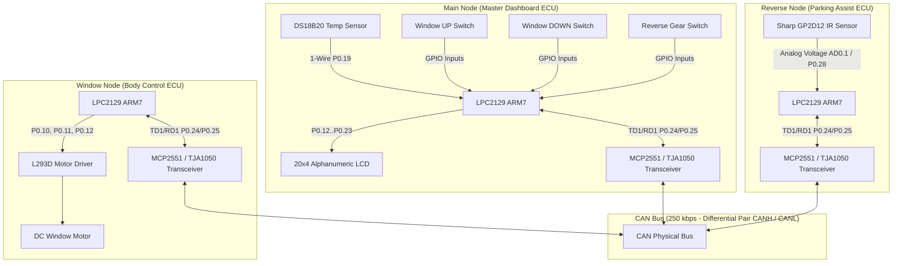

# 🚗 CAN-Based Engine Monitoring and Vehicle Control System
## Comprehensive System Engineering Documentation

---

### 1. Executive Summary
This project implements an automotive-grade distributed Electronic Control Unit (ECU) network using three **NXP LPC2129 (ARM7TDMI-S)** microcontrollers communicating over an ISO 11898 compliant **CAN 2.0B** bus at **250 kbps**.

The system features:
1. **Main Telemetry ECU (Main Node)**: Central 20×4 LCD digital instrument cluster, DS18B20 digital engine temperature monitoring with hysteresis, and driver input controls.
2. **Body Control ECU (Window Node)**: Power window bidirectional motor actuation with status telemetry feedback.
3. **ADAS / Parking Assist ECU (Reverse Node)**: Sharp GP2D12 infrared proximity sensing via 10-bit ADC with real-time zone detection and high-speed telemetry streaming.

---

### 2. High-Level System Architecture

---

### 3. CAN Communication Protocol Matrix

| CAN ID | Frame Type | DLC | Source Node | Destination | Data Byte 0 | Data Byte 1 | Description |
| :--- | :--- | :--- | :--- | :--- | :--- | :--- | :--- |
| **`0x101`** | Data Frame | 1 | Main Node | Window Node | `0x01`=UP / `0x02`=DN | - | Window Roll Up/Down Command |
| **`0x102`** | Data Frame | 1 | Main Node | Reverse Node | `0x01`=ON / `0x00`=OFF | - | Reverse Assist Enable/Disable |
| **`0x103`** | Data Frame | 2 | Reverse Node | Main Node | Distance ($10..150\text{ cm}$) | Zone ($1..4$) | High-speed Proximity Telemetry |
| **`0x201`** | Data Frame | 2 | Window Node | Main Node | Position ($0..100\%$) | Status (`0x01`=OK) | Window Actuation Acknowledgement |

---

### 4. Zone Classification Logic (Reverse Node)

| Zone Name | Zone Code | Distance Range | Action / Safety Response |
| :--- | :---: | :--- | :--- |
| **Safe Zone** | `0x01` | $\ge 80\text{ cm}$ | Full clear path; solid green bar on LCD |
| **Warning Zone** | `0x02` | $40\text{ cm} - 79\text{ cm}$ | Obstacle approaching; driver caution advised |
| **Danger Zone** | `0x03` | $20\text{ cm} - 39\text{ cm}$ | Close proximity; prepare to brake |
| **Critical Stop**| `0x04` | $< 20\text{ cm}$ | Immediate collision hazard; full stop screen alert |

---

### 5. Temperature Alert Logic with Hysteresis (Main Node)

* **Normal Operating Range**: $< 45.0^\circ\text{C}$ $\rightarrow$ Displays `[ OK ]`
* **Warming Range**: $45.0^\circ\text{C} - 60.0^\circ\text{C}$ $\rightarrow$ Displays `[WARM]` & triggers cooling fan indicator
* **High Warning Range**: $60.1^\circ\text{C} - 74.9^\circ\text{C}$ $\rightarrow$ Displays `[HIGH]` & warns driver
* **Critical Overheat Alarm**: $\ge 75.0^\circ\text{C}$ $\rightarrow$ Immediate flashing alarm screen; clears only when temp drops below $73.0^\circ\text{C}$ ($2^\circ\text{C}$ hysteresis window).
