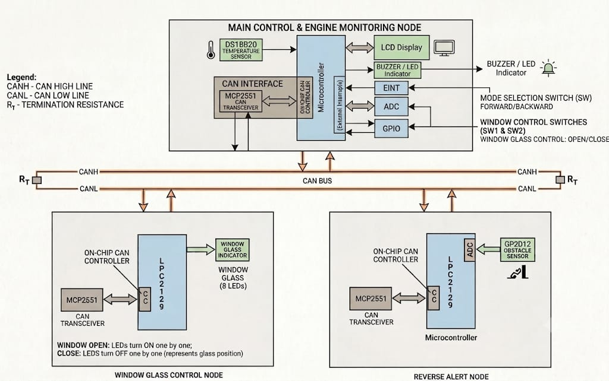
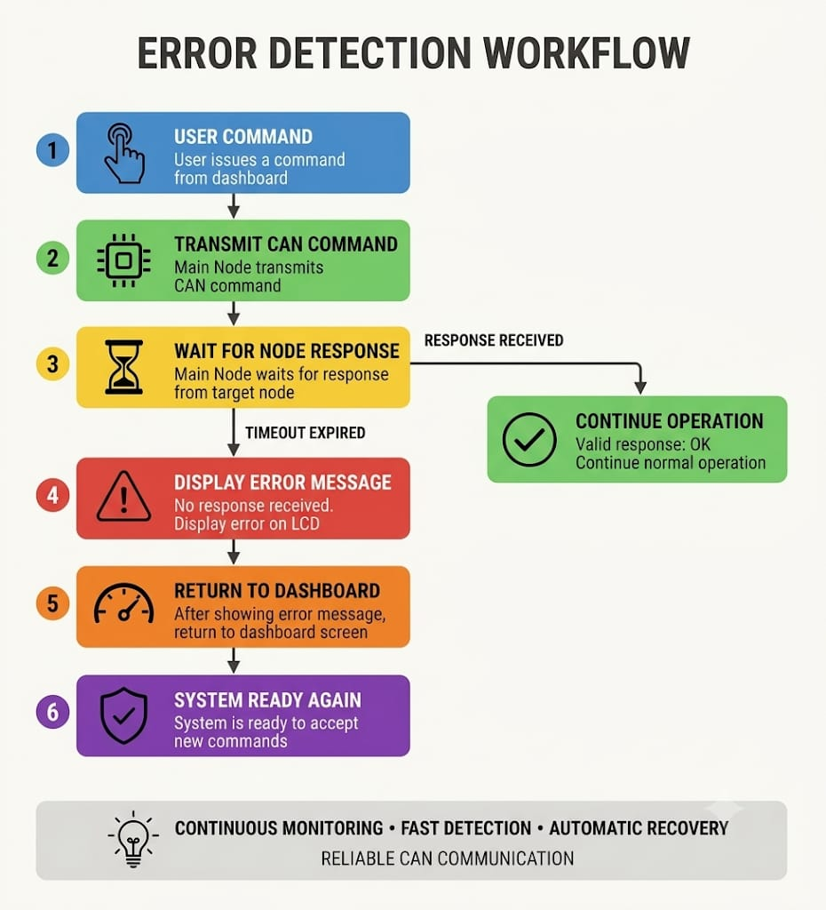
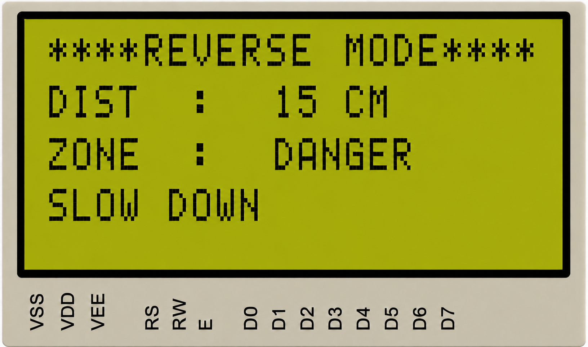

# 🚗 CAN-Based Engine Monitoring and Vehicle Control System

<p align="center">
  
  
  
  
</p>

---

# 📖 Table of Contents

- [📌 Project Overview](#-project-overview)
- [🎯 Objectives](#-objectives)
- [🖼 Block Diagram](#-block-diagram)
- [⭐ Intelligent CAN Node Failure Detection](#-intelligent-can-node-failure-detection-implementation)
- [🏗 System Architecture](#-system-architecture)
- [⚙ Hardware Requirements](#-hardware-requirements)
- [💻 Software Requirements](#-software-requirements)
- [📂 Repository Structure](#-repository-structure)
- [📨 CAN Message IDs](#-can-message-ids)
- [🚀 Features](#-features)
- [🖥 LCD Output Gallery](#-lcd-output-gallery)
  - [🖥️ Main Node](#️-main-node)
  - [🪟 Window Glass Control Node](#-window-glass-control-node)
  - [🚧 Reverse Alert Node](#-reverse-alert-node)
  - [🚨 CAN Node Failure Detection](#-can-node-failure-detection)
- [🛡 Fault Detection Workflow](#-fault-detection-workflow)
- [▶ Build & Flashing Instructions](#-build-instructions)
- [📈 Future Enhancements](#-future-enhancements)
- [👨‍💻 Author](#-author)

<br>

---

# 📌 Project Overview

This project implements a **distributed automotive embedded system** using **three NXP LPC2129 ARM7TDMI-S nodes** interconnected over a **Controller Area Network (CAN 2.0B)** operating at **250 kbps**.

The system continuously monitors engine temperature, controls power window movement, and provides real-time reverse obstacle detection using a **Sharp GP2D12 IR Distance Sensor**. The firmware incorporates **intelligent CAN node health monitoring**, enabling the Main Node to detect disconnected or unresponsive Window and Reverse nodes, display dedicated fault alerts on the 20×4 LCD, and safely recover to the dashboard without freezing or restarting the system.

<br>

---

# 🎯 Objectives

- **Engine Temperature Monitoring**: Continuous telemetry from digital 1-Wire DS18B20 sensor with multi-stage temperature warnings and hysteresis.
- **CAN Multi-Node Communication**: Reliable, collision-free distributed communication over CAN 2.0B physical bus.
- **Power Window Control**: Body control actuation simulating window roll up/down with animated feedback.
- **Reverse Obstacle Detection**: Proximity radar sensing using ADC sampling with graduated safe, warning, danger, and critical stop zones.
- **20×4 LCD Central Dashboard**: High-clarity driver instrument cluster with custom CGRAM graphics.
- **Active Real-Time Warnings**: Visual alerts for overheating, low clearance, and system abnormalities.
- **Fault-Tolerant Error Handling**: Proactive timeout detection for lost nodes with automatic dashboard recovery.

<br>

---

# 🖼 Block Diagram

<p align="center">
    
</p>

<br>

---

# ⭐ Intelligent CAN Node Failure Detection Implementation

One of the major enhancements implemented in this project is **real-time CAN Node Failure Detection and Recovery**.

Unlike a conventional CAN demo where disconnected nodes simply cause the system to freeze or stop responding, this system continuously monitors the availability of each distributed node and immediately informs the driver whenever communication is lost.

The Main Node monitors communication from:
- 🪟 **Window Glass Control Node**
- 🚧 **Reverse Alert Node**

If any node is disconnected (CANH/CANL bus severed or ECU power lost), the system automatically:
- Detects the loss of CAN communication frames via timeout counters
- Displays a dedicated LCD error message explaining which node failed
- Prevents the system from hanging or entering infinite polling loops
- Automatically returns to the primary vehicle dashboard after displaying the warning
- Continues executing engine telemetry and monitoring the remaining healthy nodes

---

### Error Detection Workflow ⚠️

<p align="center">
  
</p>

---

### Key Advantages

- ⏱ **Real-time node health monitoring**
- 🛡 **Automatic fault detection & isolation**
- 🔄 **Autonomous dashboard recovery**
- ⚡ **No firmware reboot or hardware reset required**
- 📈 **Industrial-grade CAN bus reliability**
- 👨‍✈️ **Instant driver feedback and fault transparency**

<br>

---

# 🏗 System Architecture

| Node | Hardware | Primary Responsibilities |
|:---|:---|:---|
| 🚗 **Main Node** | LPC2129 + 20×4 LCD | Master Instrument Cluster, DS18B20 Temp Acquisition, Driver Switch Inputs, CAN Bus Master |
| 🪟 **Window Glass Control Node** | LPC2129 + L293D / LEDs | Body Control ECU, Power Window Bi-directional Motor Control, Glass Level Simulation |
| 🚧 **Reverse Alert Node** | LPC2129 + Sharp GP2D12 | ADAS Parking Radar ECU, 10-bit ADC IR Linearization, Multi-Zone Distance Telemetry |

<br>

---

# ⚙ Hardware Requirements

| Hardware Component | Quantity | Purpose / Specification |
|:---|:---:|:---|
| **NXP LPC2129** | 3 | ARM7TDMI-S 16/32-bit Microcontroller with dual on-chip CAN controllers |
| **MCP2551 / TJA1050** | 3 | High-speed CAN Transceiver (Physical layer interface) |
| **DS18B20** | 1 | 1-Wire Digital Temperature Sensor ($\pm 0.5^\circ\text{C}$ accuracy) |
| **Sharp GP2D12** | 1 | Analog Infrared Distance Measuring Sensor ($10\text{ cm} - 80\text{ cm}$) |
| **20×4 Alphanumeric LCD** | 1 | HD44780-compatible Master Vehicle Telemetry Dashboard |
| **L293D Motor Driver / LEDs** | 1 | Power window motor actuation / position indicator |
| **Push Buttons** | 3 | Window UP, Window DOWN, and Reverse Mode toggles |
| **Piezo Buzzer** | 1 | Acoustic alarm for critical overheat and obstacle collision warning |
| **CAN Bus Medium** | 1 | Twisted-pair differential bus with $120\,\Omega$ termination resistors |

<br>

---

# 💻 Software Requirements

| Software / Tool | Version | Purpose |
|:---|:---|:---|
| **Keil µVision** | IDE v4 / v5 | ARM7 Embedded C compilation, assembly vector building, and linking |
| **Embedded C** | C99 standard | Peripheral driver development, timing loops, and state machines |
| **Flash Magic** | Latest | In-System Programming (ISP) tool for flashing LPC2129 via UART0 |
| **Proteus VSM** | v8+ | Multi-node CAN hardware simulation and schematic verification |
| **Git & GitHub** | Latest | Version control and distributed collaboration |

<br>

---

# 📂 Repository Structure

```text
CAN-Based-Engine-Monitoring-and-Vehicle-Control-System/
│
├── Main_Node/                         # Master Instrument Cluster ECU
│   ├── Images/                        # Telemetry and alert screenshots
│   ├── CAN.c / CAN.h                  # LPC2129 CAN1 Driver (250 kbps)
│   ├── CAN_defines.h                  # Protocol Message IDs & Command Definitions
│   ├── dashboard.c / dashboard.h      # 20x4 LCD Telemetry Display Engine
│   ├── delays.c / delays.h            # Calibrated 60MHz Hardware Delays
│   ├── DS18B20.c / DS18B20.h          # 1-Wire Digital Temperature Driver
│   ├── EINT.c / EINT.h                # Debounced Switch & Interrupt Handlers
│   ├── LCD_functions.c / LCD.h        # 20x4 HD44780 Driver + Custom CGRAM Glyphs
│   ├── MAIN_NODE.c                    # Main ECU Execution Loop & Scheduler
│   ├── project_functions.c / .h       # Non-blocking CAN Handlers & Fault Detectors
│   ├── Startup.s                      # ARM7TDMI Assembly Vector Table
│   └── types.h                        # Standard Data Types
│
├── Window_glass_control_Node/         # Body Control Power Window ECU
│   ├── Images/                        # Window state and error screenshots
│   ├── CAN.c / CAN.h / CAN_Defines.h  # CAN Message Interface (ID 0x101, 0x201)
│   ├── delays.c / delays.h            # Precise Timing Routines
│   ├── window_control.c / .h          # Motor Driver & Position Simulation
│   ├── MAIN_WINDOW_NODE.c             # Window Listener Loop
│   ├── Startup.s                      # Startup Vector Table
│   └── types.h                        # Standard Typedefs
│
├── Reverse_alert_node/                # Parking Assist / ADAS Radar ECU
│   ├── Images/                        # Distance zone and alert screenshots
│   ├── adc.c / adc.h / adc_defines.h  # 10-bit Successive Approximation ADC Driver
│   ├── CAN.c / CAN.h / CAN_Defines.h  # CAN Telemetry Interface (ID 0x102, 0x103)
│   ├── delays.c / delays.h            # Precise Timing Routines
│   ├── distance_sensor.c / .h         # Sharp GP2D12 Linearization & Zone Logic
│   ├── MAIN_REVERSE_ALERT_NODE.c      # ADAS Sensor Loop
│   ├── Startup.s                      # Startup Vector Table
│   └── types.h                        # Standard Typedefs
│
├── Documentation/                     # Technical Specifications & Guides
│   ├── Images/                        # Architecture & Flowchart Diagrams
│   ├── LCD_SCREENS_GALLERY.md         # Visual guide to all LCD states
│   ├── PINOUT_AND_WIRING.md           # Pinout maps and hardware interconnects
│   ├── SYSTEM_DOCUMENTATION.md        # Comprehensive Engineering Report
│   └── CAN_Engine_Monitoring_and_Vehicle_Control_System_Comprehensive_Documentation.pdf
├── .gitignore                         # Keil intermediate build exclusions
└── README.md                          # Main project documentation
```

<br>

---

# 📨 CAN Message IDs

| CAN ID | Hex | Direction | DLC | Description |
|:---|:---:|:---|:---:|:---|
| **WINDOW CTRL** | `0x101` | Main Node $\rightarrow$ Window Node | 1 byte | Command to roll window UP (`0x01`) or DOWN (`0x02`) |
| **REVERSE ENABLE** | `0x102` | Main Node $\rightarrow$ Reverse Node | 1 byte | Enable (`0x01`) / Disable (`0x00`) reverse radar sensing |
| **DISTANCE DATA** | `0x103` | Reverse Node $\rightarrow$ Main Node | 1 byte | Real-time obstacle distance reading ($10\text{ cm} - 80\text{ cm}$) |
| **WINDOW STATUS** | `0x201` | Window Node $\rightarrow$ Main Node | 1 byte | Live window position percentage feedback (`25%`, `50%`, `75%`, `100%`) |

<br>

---

# 🚀 Features

- ✅ **Distributed 3-Node Architecture**: Multi-master CAN network with dedicated microcontrollers for instrument cluster, body control, and ADAS.
- ✅ **Engine Temperature Monitoring**: Continuous acquisition with normal, warming, high, and critical alert thresholds.
- ✅ **Power Window Control**: Bi-directional motor actuation with live percentage updates and directional arrow animations (`▲ / ▼`).
- ✅ **Reverse Obstacle Radar**: Real-time obstacle proximity scanning with dynamic distance bar indicators.
- ✅ **Central 20×4 LCD Dashboard**: High-clarity driver instrument panel with custom CGRAM character generation (`°`, `▲`, `▼`, `█`).
- ✅ **Intelligent CAN Node Failure Detection ⭐**: Real-time heartbeat tracking with error notification and automatic dashboard recovery.
- ✅ **Window Node Fault Detection**: Immediate alert if the body control ECU loses bus communication.
- ✅ **Reverse Node Fault Detection**: Graceful fallback if the parking sensor ECU is disconnected.
- ✅ **Non-blocking Firmware Design**: Clean execution flow that prevents ECU lockups or watchdog timeouts.

<br>

---

# 🖥 LCD Output Gallery

## 🖥️ Main Node

> 📸 The following screenshots demonstrate the different LCD screens displayed by the **Main Node** during system initialization, engine monitoring, and safety alert conditions.

<table align="center">
<tr>
  <th align="center">🚀 System Initialization</th>
  <th align="center">🌡️ Normal Engine Temperature</th>
</tr>
<tr>
  <td align="center">
    
  </td>
  <td align="center">
    
  </td>
</tr>
<tr>
  <th align="center">⚠️ High Temperature Warning</th>
  <th align="center">🔥 High Temperature Status</th>
</tr>
<tr>
  <td align="center">
    
  </td>
  <td align="center">
    
  </td>
</tr>
<tr>
  <th colspan="2" align="center">🚨 Critical Overheat Alert</th>
</tr>
<tr>
  <td colspan="2" align="center">
    
    <br>
    <b>Immediate 👨‍✈️ Driver Warning Screen</b>
  </td>
</tr>
</table>

<br>

---

## 🪟 Window Glass Control Node

> 📸 The following screenshots demonstrate the LCD screens displayed during window opening and window closing operations.

<table align="center">
<tr>
  <th align="center">⬆️ Window Opening Mode</th>
  <th align="center">⬇️ Window Closing Mode</th>
</tr>
<tr>
  <td align="center" valign="top">
    
    <br>
    <b>🪟 Window Opening Animation</b>
  </td>
  <td align="center" valign="top">
    
    <br>
    <b>🔒 Window Closing Animation</b>
  </td>
</tr>
</table>

<br>

---

## 🚧 Reverse Alert Node

> 📸 The following screenshots demonstrate the LCD screens displayed by the **Reverse Alert Node** while monitoring rear obstacle distance using the **GP2D12 IR Distance Sensor**.

<table align="center">
<tr>
  <th align="center">🚗 Reverse Mode Initialization</th>
  <th align="center">🟢 Safe Zone</th>
</tr>
<tr>
  <td align="center" valign="top">
    
  </td>
  <td align="center" valign="top">
    
  </td>
</tr>
<tr>
  <th align="center">🟡 Warning Zone</th>
  <th align="center">🟠 Danger Zone</th>
</tr>
<tr>
  <td align="center" valign="top">
    
  </td>
  <td align="center" valign="top">
    
  </td>
</tr>
<tr>
  <th colspan="2" align="center">🔴 Critical Zone Alert</th>
</tr>
<tr>
  <td colspan="2" align="center">
    
    <br>
    <b>🔴 Immediate Stop Vehicle (10 cm)</b>
  </td>
</tr>
</table>

<br>

---

## 🚨 CAN Node Failure Detection

> 📸 The following LCD screens demonstrate the fault detection mechanism implemented in the Main Node. Whenever any CAN node becomes unavailable, the system automatically detects the communication timeout, displays an informative error message, and safely returns to the dashboard.

<table align="center">
<tr>
  <th align="center">🪟 Window Node Failure</th>
  <th align="center">🚧 Reverse Node Failure</th>
</tr>
<tr>
  <td align="center">
    
  </td>
  <td align="center">
    
  </td>
</tr>
</table>

<br>

---

## 🛡 Fault Detection Workflow

```text
        🚀 User Action / Periodic Poll
                     │
                     ▼
             📤 Transmit CAN Frame
                     │
                     ▼
           🔍 Monitor CAN Response
                     │
              ┌──────┴───────┐
              │              │
              ▼              ▼
       🟢 Frame Received   🔴 No Response
              │              │
              ▼              ▼
        Continue Mode    ⏱ Timeout Counter
                             │
                             ▼
                  📟 LCD Error Notification
                             │
                             ▼
                   🏠 Return to Dashboard
                             │
                             ▼
                🔄 Resume Normal Operation
```

<br>

---

# ▶ Build Instructions

1. **Open Projects in Keil µVision**:
   * Main Node: `Main_Node/main.uvproj`
   * Window Node: Open/create project in `Window_glass_control_Node/`
   * Reverse Node: Open/create project in `Reverse_alert_node/`
2. **Compile Firmware**: Click **Project $\rightarrow$ Build Target** (`F7`) to generate Intel `.hex` files.
3. **Flash LPC2129 Microcontrollers**:
   * Open **Flash Magic**, select LPC2129, COM Port, and Baud Rate (`9600` or `19200`).
   * Erase flash and program corresponding `.hex` file to each node.
4. **Hardware Connections**:
   * Interconnect `CANH` to `CANH` and `CANL` to `CANL` across all nodes with $120\,\Omega$ termination resistors at bus endpoints.
   * Connect DS18B20 1-Wire data line to `P0.19` on Main Node.
   * Connect Sharp GP2D12 analog output to `P0.28` (`AD0.1`) on Reverse Node.
   * Connect LCD data/control lines to `P0.12 - P0.23` on Main Node.
5. **Power ON**: Supply regulated 5V/3.3V power to the nodes and observe the boot splash sequence on the LCD!

<br>

---

# 📈 Future Enhancements

- [ ] **CAN Bus-Off Recovery**: Automatic re-initialization of CAN controller hardware upon Bus-Off error states.
- [ ] **Error Passive Monitoring**: Dynamic bus diagnostics to track transmit/receive error counters (`TEC` / `REC`).
- [ ] **Diagnostic Trouble Codes (DTC)**: Implementation of unified ISO 14229 (UDS) / OBD-II fault logging in EEPROM.
- [ ] **CAN Telemetry Logger**: High-speed SPI SD card or UART gateway for logging real-time CAN traffic.
- [ ] **RTOS Migration**: Porting firmware to FreeRTOS for deterministic, priority-preemptive ECU task scheduling.

<br>

---

# 👨‍💻 Author

**Deekshith Tupakula**  
*Embedded Systems Engineer*

Specialized in: **Embedded C | ARM7 (LPC2129) | CAN | Automotive ECUs | Keil µVision | Sensor Interfacing**
